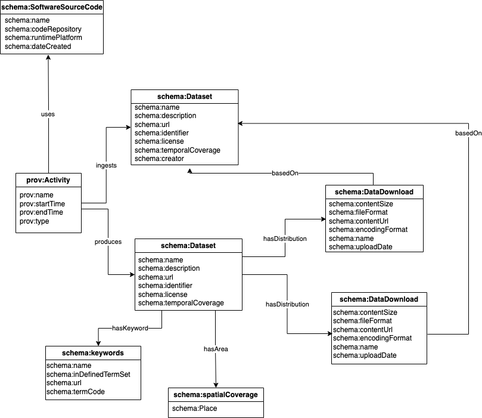

class: center, middle

```{r, out.width = '25%', echo=FALSE}

```

# Data Governance Handbook Walkthrough

```{r, out.width = '40%', echo=FALSE}

```

.large[Kassy Raymond | GBADs Informatics | 4 April 2023]
---

layout: true
background-image: url(https://i0.wp.com/animalhealthmetrics.org/wp-content/uploads/2019/10/GBADs-LOGO-Black.png?w=360&ssl=1)
background-position: 5% 100%
background-size: 15%

---

<!-- edit name1 and name2 in the YAML above -->

```{r setup, include=FALSE}
options(htmltools.dir.version = FALSE)
knitr::opts_chunk$set(warning = FALSE, message = FALSE)
library(tidyverse) # load tidyverse package
library(emo)
library(fontawesome)
#library(leaflet) # uncomment to use if you install
```

```{r xaringan-themer, include=FALSE}
library(xaringanthemer)
style_mono_accent(
  header_color = "#FFA500",
  header_font_google = google_font("Josefin Sans"),
  text_font_google   = google_font("Montserrat", "400", "700i"),
  code_font_google   = google_font("Droid Mono")
)
```

```{r ref-manager, include=FALSE}
library(RefManageR)
BibOptions(check.entries = FALSE, bib.style = "authoryear", style = "html")
#file.name <- system.file("/Users/kassyraymond/PhD/trunk/Presentations/DGHPresentation/Data\ Governance\ Handbook\ Presentation", "myBib.bib", package = "RefManageR")
# print(file.name)
bib <- RefManageR::ReadBib("myBib.bib")

```

# Agenda

1. Introduction

2. Data Governance Handbook Walkthrough

3. Current challenges 

4. Needs from collaborators 

5. Discussion and next steps

???

This morning our webinar will consist of a 30 minute presentation followed by a discussion. We will have time at the end for questions 

In our data governance handbook walkthrough today we are going to go through what data governance is and why we need data governance. 

I will then walk you through the handbook, including our data principles, data goals, and the sections of handbook

I will then talk about group responsibilities and current challenges with data governance 

We will discuss what we need from collaborators when it comes to data governance 

Then, we will have time for discussion and next steps.

---

# Agenda

1. **Introduction**

    * What is data governance? 
    * Importance of data governance 
    * Components of a data governance strategy/framework

2. Data Governance Handbook Walkthrough

3. Current challenges 

4. Needs from collaborators 

5. Discussion and next steps

???
So first, what is data governance, why is it important, and what components should be in our data governance strategy? 

---

class: middle, center
### `r emo::ji("warning")` (Some of) the main assets of GBADs include data, models, and modelling outputs `r emo::ji("warning")`

???

I want you to keep this in mind throughout the presentation. we could argue that the main assets of GBADs include the data models and modelling outputs. yes, the data belongs to others, but we are consolidating it in one place and harmonizing it's structure which means we are able to compare this data better. We are also producing models which create outputs that will inform policy decisions. 

So keeping this idea in mind...

---

.left.top.header[1 - Introduction - What is data governance?]

## What is data governance? 

"Everything you do to ensure data is secure, private, accurate, available, and usable. 

It includes: 

`r emo::ji("clapper")` the actions people must take,

--
   
`r emo::ji("anticlockwise")` the processes they must follow, and,

--

`r emo::ji("developer")` **the technology** that supports them throughout the data life cycle." .small[`r Citep(bib, "googleDataGov")`]

???

Google defines data governance as everything you do to ensure data is secure, private, accurate, available, and usable including the actions people must take, the processes they must follow and the technology that supports them throughout the data life cycle.

In other words, data governance is the overall management framework for data assets, and data derived assets (such as models).

It is a set of policies, procedures, and standards that define how data is collected, processed, analyzed, and shared across an organization. 

The goal of data governance is to ensure that data is accurate, complete, and consistent across different systems, and that it is used in compliance with relevant regulations and best practices. As we will learn, data governance can help organizations and programs reach program or organizational-specific goals, particularly in data-driven estimates such as models. 

---

class: middle,center

.left.top.header[1 - Introduction - Importance of Data Governance]


# Why Data Governance?


???

So.... why data governance? well.. let's start with the negative stuff


Data governance is essential to mitigate the negative consequences of having poor data governance. Some of such consequences include: 

---
.left.top.header[1 - Introduction - Importance of Data Governance]

## (Some) Impacts of Poor Data Governance `r emo::ji("bowing")`

--

* Poor data quality 


* Low trust in estimates, data, modelling outputs 

--

* Can't access or find data


* Private data is not secure 

--

* Can't reproduce or replicate data cleaning or modelling methodologies  


* Can't understand the context or meaning of data

???


GBADs needs data governance because our work is so centered around data. We are data users and creators. The models themselves need also to be governed including the inputs and outputs.

By implementing data governance practices, we can reduce the risk of errors in our analysis, improve replicability and reproducibility, increase the efficiency of our research and ultimately produce better results and mitigate our risk of the impacts of poor data governance 

---

.left.top.header[1 - Introduction - Importance of data governance]
## Data governance ensures that there are processes and tools in place for: 

.pull-left[
`r fa('medal')` Data Quality

`r fa('database')` Data Storage

`r fa('user-secret')` Data Security and Privacy

`r fa('gear')` Data Standards and Metadata]

.pull-right[

`r fa('universal-access')` Data Access

`r fa('arrows-spin')` Data Lifecycle Management & Verison Control

`r fa('recycle')` Reproducibility ]

--

### **... and all these processes need to be documented**

---

.left.top.header[1 - Introduction - Components of a data governance strategy]

# The Big Picture 

.pull-left[

Through a data governance strategy that addresses: 
* discoverability,
* security,
* accountability 
* (and standards)

.tiny[`r Citet (bib, 'eryurek2021')`]]

.pull-right[

]

---

.left.top.header[1 - Introduction - Components of a data governance strategy]

# The Big Picture 

.pull-left[

Through a *data governance strategy* that addresses: 
* discoverability,
* security,
* accountability 
* standards

.tiny[`r Citet (bib, 'eryurek2021')`]]

.pull-right[

]

---
.left.top.header[1 - Introduction - Components of a data governance strategy]

# Data Governance Strategy

**parts:**

`r fa('scale-balanced')` Data Principles

--

`r fa('bullseye')` Data Goals

--

`r fa('gears')` Processes, people & technologies to meet goals and that align with principles 

--

`r fa('map')` A roadmap and communication plan that


*Communicates all elements of data governance to internal and external stakeholders*


---

class: center
.left.top.header[1 - Introduction]

<br></br>
<br></br>

.middle[# `Hello` Data Governance Handbook]

---

# Agenda

1. Introduction

2. **Data Governance Handbook Walkthrough**
    
    * Overview
    * Handbook navigation and structure 
    * Data principles and goals 
    * Overview of each section of the handbook

3. Current challenges

4. Needs from collaborators

5. Discussion and next steps

???
In our handbook walkthrough we will provide an overview of the handbook and the main gaols

We provide information about navigating the handbook and its overall structure

We'll give information about the data principles and goals that underlie the data governance framework

and we provide a overview of each section of the handbook with emphasis on the sections that are most relevant for you

---

.left.top.header[2 - Data Governance Handbook Walkthrough - Overview]


<br></br>
#### The Data Governance Handbook is available online on the GBADs Informatics Documentation Server Website

`r fa('link')` https://gbadskedoc.org/docs/Data-Governance-Handbook-for-GBADs/intro

???
The data governance handbook is available online on the GBADs Informatics Documentation Server Website 

So it starts with an overview of what the book is all about

---

.left.top.header[2 - Data Governance Handbook Walkthrough - Overview]


* Describes how we **<u>manage</u>** data and metadata in the Knowledge Engine

--

* Documents the **<u>guidelines, standard practices, best practices, and procedures</u>** related to GBADs data use, management, and governance

--

* Outlines **<u>individual and group data management and governance responsibilities</u>**.

???

And in general, it describes how we manage data and metadata in the Knowledge Engine, it documents the guidelines, standard practices, best practices ..


---

.left.top.header[2 - Data Governance Handbook Walkthrough - Overview]


.center.middle[

The Data Governance Handbook is a **"living document"**. This means that it is continuously updated and edited.]

???
The data governance handbook is a living document.

We can't anticipate the changing circumstances and evolving needs that may come with our data practices. 

The living document allows us to addm ore info as new best practices emerge 

We can also continually improve the document based on feedback and lessons learned

and.. it is living because we want to encourage collaboration and feedback from multipel stakeholders so we can ensure that it can get to a point where it is comprehensive and reflects the needs of all parties that it might be applicable to 

We also are still developing our methods and software for each component of data governance. For instance, we have software developers working on data quality but we are still deciding on metrics. Therefore, we will document these practices as we create them.

---

.left.top.header[2 - Data Governance Handbook Walkthrough - Handbook navigation and structure]

### Navigating the Handbook


???
First, to get to the handbook you go to GBADs Informatics Doc site and click on 'Docs' on the navigation bar. 

Then, click on data governance handbook for gbads. 

This should open up the left navigation pane which shows each chapter in the book. The right navigation pane shows the subsections of each chapter in the book. 

So if you click "Reproducibility" for example, it will bring you down to that section.

You can also see where you are in the handbook by looking at the top of the book. So you can see the Data Gov. Handbook for GBADs > Data principles 

---

.left.top.header[2 - Data Governance Handbook Walkthrough - Data principles and goals]

.pull-left[
]

## Data Principles and Goals

`r fa('arrow-right')` Provide direction and purpose for data governance

`r fa('bullseye')` Goals specify the desired outcomes 

`r fa('align-left')` Principles guide behavior and decision-making involved in managing data, ensuring alignment with core values

???

So firstly, our goals and principles for data governance: 

Goals and principles are important in a data governance framework because they provide a clear direction and purpose for managing data within an organization. 

Goals specify the outcomes that an organization seeks to achieve through its data governance program, 

while principles guide the behavior and decision-making of individuals involved in managing data. 

So for example, if our goal was to ensure that data is accessible, and one of our data principles was to ensure that we are trustworthy, we would make sure that data is accessible, but only to those who have permission. So in sum,
they provide a framework for ensure that the data governance procedures align with the organization's mission and values. 
---

.left.top.header[2 - Data Governance Handbook Walkthrough - Data principles and goals]

.pull-left[
]

## Data Principles

.pull-right[

 FAIR(S) & 
 CARE &
 Trust &
 Reproducibility 
 


]


???

Our data principles are highlighted in the data principles section of the handbook.

So our main data principles include ensuring that data is findable, accessible, interoperable and reusable or fair ... 

---

.left.top.header[2 - Data Governance Handbook Walkthrough - Data principles and goals]

.pull-left[
]

## Goals

.pull-right[
`r emo::ji('sparkles')` 12 Data Goals for GBADs `r emo::ji('sparkles')` 
split into 4 categories: 


* .blue-button[general]

* .red-button[data and metadata]

* .yellow-button[models and data visualizations]

* .green-button[data literacy]]

???

The data governance operating model section provides a detailed breakdown of the data goals used for GBADs, and the specific repsonsibilities of each working group. 

We have used the working group structure to provided a detailed breakdown of the data goals for GBADs, along with the specific responsibilities of each working group. The Working groups have overlapping responsibilities to ensure that these goals are met and that data practices are aligned with the principles to ensure trust and confidence in our decision making. 

---

.left.top.header[2 - Data Governance Handbook Walkthrough - Overview of each section - .red-button[Data Quality]]


## Data Quality 


???

Data quality is an essential component of data governance as it ensures that the data used by GBADs is accurate and reliable, which is crucial for producing high-quality models and outputs. 

To find information about data quality practices you can navigate to the data quality pane in the handbook

The definition of data quality depends on the context of use, and GBADs use six dimensions of data quality to assess and communicate the quality of data.

While data quality falls under the responsibility of working groups 2 and 3, GBADs informatics is developing tools to support data quality analysis, including data "stories," analysis of data sources, and ontology and SHACL for validating data.

We are still populating this part of the handbook as the students finish up their preliminary data quality analysis for the summer.

---

.left.top.header[2-Data Governance Handbook Walkthrough - Overview of each section - .red-button[Metadata]]

## Metadata 

.pull-left[


"Data about data" 

How we are documenting data

How we are documenting data provenance (how data flows across lifecycle)

Standards we are using

How metadata is being managed]

.pull-right[

]

???

Metadata management is the process of organizing, storing, and maintaining metadata. In graph databases, metadata management can involve tasks such as defining and enforcing a schema, ensuring data quality and consistency, and providing access control and security.

We want to ensure that all our data is well documented so it can be findable, accessible, interoperable, and reusable in the knowledge engine. We also want others to know what standards we are using so they can interpret the metadata that we provide. 

This is all documented in the metadata section of the handbook.

We also provide information about data lineage and provenance, and how metadata is being managed in graph databases (including what graph databases are.)

---

.left.top.header[2-Data Governance Handbook Walkthrough - Overview of each section - .red-button[Education and Best Practices ]]

.pull-left[

]

.pull-right[

### Educational Materials and Best Practices 

Best practices for coding

How to organize spreadsheets according to best practices 

Tutorial for GitHub

]


???
The next section of the handbook is educational materials and best practices

Right now this consists of best practices for coding in R, how to format data in spreadsheets so that they can be easily interpreted and ingested by software, and how to use GitHub,


---

.left.top.header[2-Data Governance Handbook Walkthrough - Overview of each section - .red-button[Accessing Data in the Knowledge Engine]]

.pull-left[

]

### Accessing Data in the Knowledge Engine (KE)

Classifies data "types" in the KE 

Describes methods for data storage and access

Provides info on how to access each type of data 

### .center[]

???
In this section we classify the types of data in the KE, we describe the methods for storage and access, and we provide info on how to access each type of data.

So going back to the handbook, we can see that 

To access data in the Knowledge Engine, there are two main ways: through the Application Programming Interface (API) and direct download through a URL from an Amazon S3 Bucket. 

And that there are three main types of data stored in the Knowledge Engine are input data, output data from models, and intermediate data sets.

Input data includes raw data obtained from sources such as  (FAOSTAT), parameters obtained from meta-analyses from systematic reviews, and data sets produced from expert elicitation exercises.

Output data from models may be used in subsequent models or estimations, and intermediate data sets are produced through a stage in modeling or imputation but are not considered an end product. 

We can find definitions of APIs and S3 buckets, as well as other storage and information about the different ways you can access the data including the API, the data portal interface, the S3 bucket.

So the API provides machine-to-machine access to data, and the current functionality includes providing access to data contained in the public databases, providing a list of all tables contained in the public databases, and providing names of all fields and data types of those fields for a given table. 

Data from the API is also available via Amazon S3 buckets, which is a cloud object storage service that allows users to store data and other digital objects in the cloud.

---

.left.top.header[2-Data Governance Handbook Walkthrough - Overview of each section - .red-button[Data Licenses, Security and Privacy]]

## Data Licenses, Security and Privacy


???
Finally we have data licenses security and privacy. We aren't currently hosting any private data, but we need to be able to anticipate how we will handle it.

This section provides all information about how we plan on keeping private data private and secure including the technology that will support this. 

This is especially important for anyone interested in data alliances because we want to make sure that potential sources know we can handle their personal and private data. 

---

# Agenda

1. Introduction

2. Data Governance Handbook Walkthrough
    
3. **Current challenges**

    * Issues that arise when data governance is not implemented

4. Needs from collaborators

5. Discussion and next steps

---

.left.top.header[3 - Current challenges - Issues that arise when data governance is not implemented]

## Issues that arise when data governance is not implemented

`r emo::ji('scream')` Inconsistent results 

--

`r emo::ji('trash')` Wasted time and resources 

--

`r emo::ji('dizzy')` Errors and inaccuracies 

--

`r emo::ji('chart decreasing')` Reduced reproducibility 

--

`r emo::ji('cry')` Lack of credibility and trust

---

# Agenda

1. Introduction

2. Data Governance Handbook Walkthrough

3. Current challenges

4. **Needs from collaborators**

    * Adopt our data sharing and reproducibility culture  
    * What our data governance strategy is missing
    * Feedback and contributing

5. Discussion and next steps

---

.left.top.header[4 - Needs from collaborators - Adopt our data sharing and reproducibility culture ]

.pull-left[
]

### Adopt our data sharing and reproducibility culture by: 

* Using the data that is available in the GBADs KE 

--

* Let us know when you have a new dataset

--

* Ensuring that all modelling efforts are well documented, code is in GitHub, and inputs and outputs from models are documented 

---

.left.top.header[4 - Needs from collaborators - What our DG strategy is missing ]

## Needs from collaborators

**Reminder**: Data governance includes defining how data is **processed**, **analyzed**, and **shared** across the program.

--

.center[]
.tiny[Figure from: https://gbads.firstanalytics.us/#AMU-Regional-Global]

.center[**This includes models and estimates!**]

???
So in review, so far we have gone through the basics of data governance and why we need it, what the data governance handbook is, why we need it, and how we can use it.

Given our definition of data governance, it also includes how data is processed, analyzed and shared across the program. Informatics is dealing with how to store data and provide a means for dissemination and discovery of data in the knowledge engine, but what about the data that is processed or analyzed into....

models and estimates... 

Therefore models themselves have to be part of the data governance strategy. But I am not a modeler :( so it is currently not part of our handbook... 

---

.left.top.header[4 - Needs from collaborators - What our DG strategy is missing ]

## Best practices for modelling 

#### How are you: 

* Documenting models

--

* Validating models

--

* Calculating uncertainty

--

* Structuring outputs from models 

--

* Ensuring that others have access to your models and outputs 

--

* Handling model versioning and change control

--

* Educating stakeholders on how models work

???

Some examples of information that might be in our data governance strategy for models include how models are being documented including the inputs and outputs of models.

How you are validating models, how you calcualte uncertainty, structure outputs..... 

---

.left.top.header[4 - Needs from collaborators - Feedback and contributing ]

## Feedback and contributing 

The Data Governance Handbook is meant to be a **collaborative** handbook to document how we use data as a program. 

--

.pull-left[
### **2 ways to contribute:** 

1. Email me with edits and suggestions (final slide has contact info)

2. Contribute on GitHub]

.pull-right[
]
.small[]

???

given that best practices also exist when it comes to modelling, these processes and procedures need to find their way into the data governance handbook. 

There are 2 ways to contribute

The first thing you could do is email me with edits and suggestions - the final slide of this presentation will have my contact info

or you could opt for the second option which is our preferred way - contributing to the handbook directly on GitHub.


---
.left.top.header[4 - - Needs from collaborators - Feedback and contributing]
.left[## Contributing to the Data Governance Handbook on GitHub  `r fa('github')`]

.pull-left[
#### Contribute changes to repo

]

.pull-right[
#### Create an issue
]

`r emo::ji('scream')` **but I don't know how to use GitHub...**

???

And if this is your preference, which we hope it is, you have two options. First you can contribute changes to the repository or second you can create an issue on GitHub. 

if you don't know how to use GitHub...

We have a tutorial for that! 

---

class:middle, center

#### `r emo::ji('tada')` there is a GitHub tutorial in the handbook


.tiny[
.left[
`r fa('link')` [https://gbadskedoc.org/docs/Data-Governance-Handbook-for-GBADs/educationalMaterials#github-tutorial)](https://gbadskedoc.org/docs/Data-Governance-Handbook-for-GBADs/educationalMaterials#github-tutorial)]]

???

The GitHub Tutorial is located in the 'Educational Materials and Best Practices' chapter. For easy access you can use the right navigation pane to select GitHub Tutorial 

---

# Agenda

1. Introduction

2. Data Governance Handbook Walkthrough

3. Current challenges

4. Needs from collaborators

5. **Discussion**

---

# Thank you! 

### Find GBADs Informatics: 

`r fa('link')` Informatics Documentation Site: https://gbadskedoc.org/

`r fa('link')` GBADs Data Governance Handbook: https://gbadskedoc.org/docs/Data-Governance-Handbook-for-GBADs/intro


### Contribute to the Data Governance Handbook on GitHub:
`r fa('github')` GBADs Informatics: https://github.com/GBADsInformatics/Docs

`r fa('envelope')` kraymond@uoguelph.ca

???
And with that I will leave you all with some links and contribution info. 

---

#### References: 

`r RefManageR::PrintBibliography(bib)`

.tiny[
<p><cite><a id='bib-carroll2020'></a><a href="#cite-carroll2020">Carroll, S. R., I. Garba, O. L. Figueroa-Rodríguez, et al.</a>
(2020).
&ldquo;The CARE principles for indigenous data governance.&rdquo;
</p></cite></p>

<p><cite><a id='bib-eryurek2021'></a><a href="#cite-eryurek2021">Eryurek, E., U. Gilad, V. Lakshmanan, et al.</a>
(2021).
<em>Data Governance: The Definitive Guide</em>.
O'Reilly Media, Inc.</cite></p>

<p><cite><a id='bib-googleDataGov'></a><a href="#cite-googleDataGov">Google</a>
(2023).
<em>What is Data Governance?</em>
<a href="https://cloud.google.com/learn/what-is-data-governance">https://cloud.google.com/learn/what-is-data-governance</a>.
Accessed: 2023-03-06.</cite></p>

<p><cite><a id='bib-stacey2022'></a><a href="#cite-stacey2022">Stacey, D., K. Wulff, N. Chikhalla, et al.</a>
(2022).
&ldquo;From FAIR to FAIRS: Data security by design for the global burden of animal diseases&rdquo;.
In: <em>Agronomy Journal</em> 114.5, pp. 2693&ndash;2699.</cite></p>

<p><cite><a id='bib-wilkinson2016'></a><a href="#cite-wilkinson2016">Wilkinson, M. D., M. Dumontier, I. J. Aalbersberg, et al.</a>
(2016).
&ldquo;The FAIR Guiding Principles for scientific data management and stewardship&rdquo;.
In: <em>Scientific data</em> 3.1, pp. 1&ndash;9.</cite></p>]


